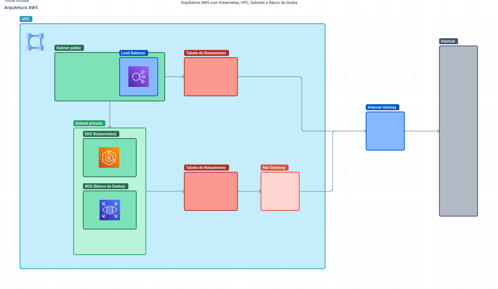

<h3 align="center">Fest Food API - Tech Challenge - 8SOAT FIAP</h3>

---

<p align="center"> Infra estrutura AWS desenvolvido por alunos do Pós Tech - FIAP. Fase 3.
    <br> 
</p>

## 📝 Índice

- [Sobre](#about)
- [ArquiteturaAWS](#arquitetura_AWS)
- [Comece por aqui](#getting_started)
- [Ferramentas](#built_using)
- [Desenvolvedores](#authors)

## 🧐 Sobre <a name = "about"></a>

A infraestrutura consiste em... Amazon Web Services (AWS)... (Em contrução)

#### Arquitetura AWS <a name = "arquitetura_AWS"></a>

[]

## 🏁 Comece por aqui <a name = "getting_started"></a>

Comandos para criar a estrutura na AWS.

### Terraform
Para rodar o projeto usando o terraform, é necessário seguir as etapas abaixo.

1. Instalar terraform. (Consulte: [Ferramentas](#built_using))

2. No powershell, como administrador, execute o seguinte comando para criar a estrutura:
```
$ terraform init
$ terraform validate
$ terraform plan
$ terraform apply
```
2. No powershell, como administrador, execute o seguinte comando para destruir a estrutura:
```
$ terraform destroy
```

## ⛏️ Ferramentas <a name = "built_using"></a>

- [Terraform](https://www.terraform.io//) - Terraform.

## ✍️ Desenvolvedores <a name = "authors"></a>

- Handryo Casali
- Nicole Escobar Alves
- Luis Henrique Carreira
- Victor Hugo Silva Lima

